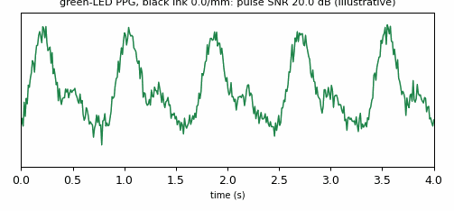
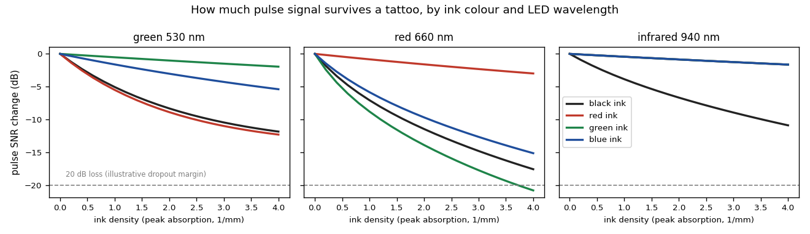
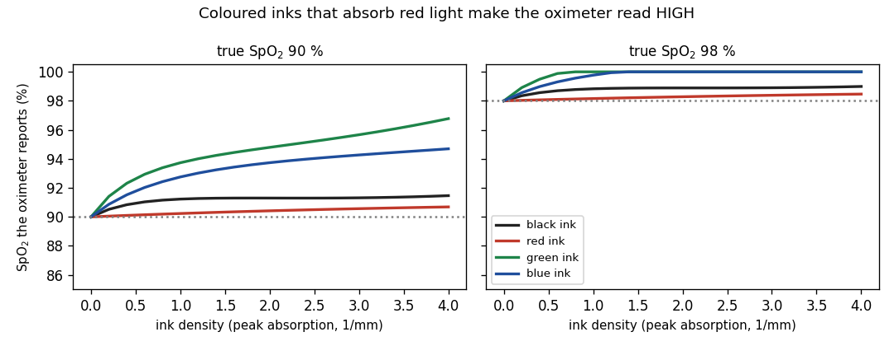
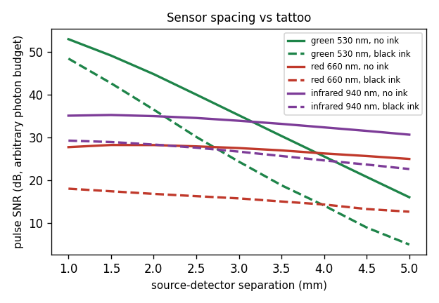

# TattooOptics

[](https://github.com/hxlvvm/TattooOptics/actions/workflows/tests.yml)

**Why smartwatches struggle on tattoos: a tissue-optics model of tattooed wrist PPG and pulse oximetry.**

Optical heart-rate sensors are known to fail over tattoos. In a controlled study, heart rate dropped out at
rest in 9 of 25 participants measured over tattooed skin (Navalta et al., 2025). A 2026 systematic review
found that the mechanism has only been described qualitatively. `TattooOptics` is an open, mechanistic model of
it: a photon Monte Carlo through layered skin with a pigment sheet in the dermis. It predicts how much
pulse signal survives each ink colour at each LED wavelength, and **what a coloured tattoo could do to a
pulse-oximeter reading**.



*Green-LED PPG over black ink of rising density. Illustrative low-power case: 20 dB pulse SNR on ink-free skin, with the model's SNR loss applied.*

## Findings (model predictions)

**1. Each ink colour attacks a different LED.** Pulse signal-to-noise change at a 2 mm source–detector
spacing, ink density 2 mm⁻¹ at the absorption peak:

| ink | green 530 nm (heart rate) | red 660 nm | infrared 940 nm |
|---|---|---|---|
| black | −8.3 dB | −11.4 dB | −6.7 dB |
| red | **−8.9 dB** | −1.6 dB | −0.9 dB |
| green | −1.0 dB | **−13.9 dB** | −0.9 dB |
| blue | −3.0 dB | **−9.7 dB** | −0.9 dB |

A red tattoo hits green-LED heart-rate sensors about as hard as black ink does, but it barely touches
infrared. That suggests a simple fallback: switch channel over coloured ink.



**2. Inks that absorb red light make an oximeter read high.** The oximeter is calibrated on ink-free skin.
At a true SpO₂ of 90 %, it reads:

| ink density (1/mm) | 0.5 | 1 | 2 |
|---|---|---|---|
| green ink | 92.6 % | 93.7 % | **94.8 %** |
| blue ink | 91.8 % | 92.8 % | 93.7 % |
| black ink | 90.9 % | 91.2 % | 91.3 % |
| red ink | 90.1 % | 90.2 % | 90.4 % |

The mechanism: ink in the dermis preferentially removes the long, deep red-light paths that cross the most
blood. The red pulse weakens relative to infrared, the ratio of ratios falls and the oximeter reports more
oxygen than there is. **Over-reading is the dangerous direction**, because it can hide hypoxaemia, the same
concern raised for skin pigmentation. Measured studies so far report heart-rate dropout rather than SpO₂
bias, so this is a prediction to test, not an observed effect.



**3. Under black ink, keep green LEDs close, or switch to infrared.** With black ink, the green channel
loses more the further the detector sits from the LED: about 4–5 dB at 1 mm but about 11 dB at 5 mm. Red
and infrared lose a roughly constant amount. Beyond roughly 2.3 mm, infrared over black ink keeps more pulse
SNR than green does.



## How it works

1. **White Monte Carlo** (`tattooptics.mc`):
   - One million photon packets per wavelength scatter through skin (Henyey–Greenstein, g = 0.9, Jacques
     2013 scattering). They are reflected or escape at the skin–air interface (Fresnel, n = 1.4).
   - For every escaping photon, the code stores its exit distance and its path length in each 50 µm depth
     slice.
2. **Absorption afterwards** (`tattooptics.ppg`):
   - Each photon is reweighted by `exp(−Σ μa,k L_k)`, so any melanin level, blood oxygenation, ink colour,
     density or depth is a millisecond re-weighting. No new simulation is needed.
   - The PPG modulation follows to first order from the weighted path through blood. The signal-to-noise
     ratio uses photon shot noise.
3. **Oximetry**:
   - The ratio of ratios (AC/DC at 660 nm over AC/DC at 940 nm) is calibrated against true SpO₂ on ink-free
     skin.
   - It is then inverted for tattooed skin.

A plain-language walkthrough is in [docs/theory.md](docs/theory.md).

## Validation

- The photon transport matches **diffusion theory** within 15 % at 1–4 mm (Kienle & Patterson 1997 escape
  form). That is the expected accuracy of diffusion theory this close to the source.
- Unit tests cover:
  - Fresnel reflection;
  - Henyey–Greenstein sampling;
  - photon bookkeeping;
  - the direction of every ink effect.

```bash
pip install -e ".[examples,dev]"
pytest -q                              # about a minute
python examples/make_mc.py             # 1e6 photons per LED wavelength (~10 min each, one CPU core)
python examples/analyse.py             # figures + the numbers above
```

## Limitations

- **Inks are hypothetical.** Real pigments are brand-specific and poorly characterised. Inks here are
  parametric absorbers (carbon black ∝ λ⁻¹; coloured inks as a Gaussian absorption band), so results are
  what-if maps, not predictions for a particular device or tattoo.
- Flat layered skin with depth-independent scattering. No pigment scattering, motion, ambient light or
  hair.
- The photon budget, and so the absolute SNR and the 20 dB dropout line, is an assumption. Compare
  configurations with each other.
- First-order pulse model; blood is pulsatile throughout the dermis.

## Related work

- Navalta J.W. et al. *The effect of tattoos on heart rate validity in the Polar Verity Sense commercial
  wearable device.* Sensors 25(22):6896, 2025. [doi:10.3390/s25226896](https://doi.org/10.3390/s25226896)
  (empirical; no optical model)
- Rojas-Valverde D., Gamboa-Salas J. *TattooGate: a systematic review of tattoo pigment interference with
  wearable photoplethysmographic sensors.* Rev Cienc Ejerc FOD, 2026.
  [doi:10.29105/rce-fod.v21i2.184](https://doi.org/10.29105/rce-fod.v21i2.184)
- Ajmal et al. *Monte Carlo analysis of optical heart rate sensors in commercial wearables: the effect of
  skin tone and obesity on the PPG signal.* Biomed Opt Express 12(12):7445, 2021.
  [doi:10.1364/BOE.439893](https://doi.org/10.1364/BOE.439893) (closest method; no ink layer)

## References

- Jacques S.L. *Optical properties of biological tissues: a review.* Phys Med Biol 58:R37, 2013.
  [doi:10.1088/0031-9155/58/11/R37](https://doi.org/10.1088/0031-9155/58/11/R37)
- Farrell T.J., Patterson M.S., Wilson B.C. Med Phys 19:879, 1992.
  [doi:10.1118/1.596777](https://doi.org/10.1118/1.596777)
- Kienle A., Patterson M.S. J Opt Soc Am A 14:246, 1997.
  [doi:10.1364/JOSAA.14.000246](https://doi.org/10.1364/JOSAA.14.000246)
- Haemoglobin extinction coefficients: S. Prahl, Oregon Medical Laser Center compilation (Gratzer, Kollias).
  Only the three LED wavelengths are used.

## License

MIT
